# 🚚 Transport Company - Sistema de gestión de pedidos

## 📖 Descripción del proyecto

**Transport Company** es una aplicación web integral desarrollada con Spring Boot y Thymeleaf para la gestión completa de una empresa de transporte y logística. El sistema permite administrar clientes, pedidos, rutas y facturas. 

### 🎯 Temática

El proyecto simula el funcionamiento de una empresa de transporte que:
- Gestiona clientes y sus pedidos
- Asigna rutas específicas a cada pedido
- Genera facturas automáticamente para cada pedido

## 🗂️ Diagrama Entidad-Relación (ER)

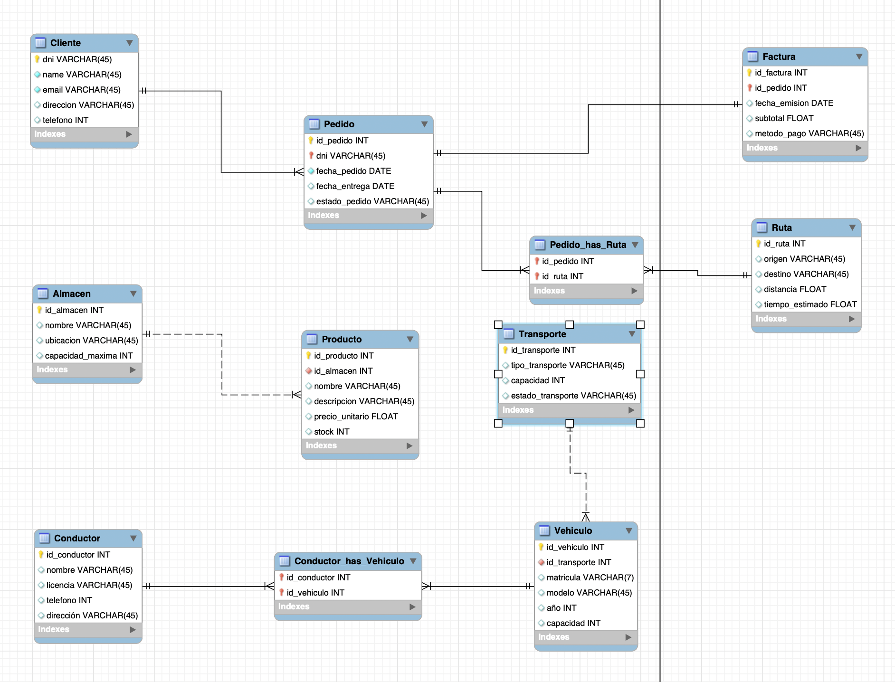


### Cardinalidades
- **Cliente - Pedido**: 1:N (Un cliente puede tener múltiples pedidos)
- **Pedido - Factura**: 1:1 (Cada pedido tiene una única factura)
- **Pedido - Ruta**: M:N (Un pedido puede tener múltiples rutas y viceversa)
- **Almacen - Producto**: 1:N (Un almacén contiene múltiples productos)
- **Conductor - Vehiculo**: M:N (Un conductor puede manejar varios vehículos)
- **Transporte - Vehiculo**: 1:N (Un tipo de transporte tiene múltiples vehículos)

## 🚀 Instalación y Ejecución

### Prerrequisitos
- Java 17 o superior
- Maven 3.8+
- MySQL 8.0+
- IDE recomendado: IntelliJ IDEA, Eclipse o VS Code

### Pasos de Instalación

1. **Clonar el repositorio**
```bash
git clone https://github.com/tu-usuario/transport-company.git
cd transport-company
```

2. **Configurar la base de datos**

Crear la base de datos en MySQL:
```sql
CREATE DATABASE transport_company CHARACTER SET utf8mb4 COLLATE utf8mb4_unicode_ci;
```

3. **Configurar `application.properties`**
```properties
spring.application.name=transportcompany

# Configuración de MySQL
spring.datasource.url=jdbc:mysql://localhost:3306/transportcompany
spring.datasource.username=tu_usuario
spring.datasource.password=tu_contraseña
spring.datasource.driver-class-name=com.mysql.cj.jdbc.Driver

# Configuración de JPA/Hibernate
spring.jpa.hibernate.ddl-auto=update
spring.jpa.show-sql=true
spring.jpa.properties.hibernate.format_sql=true
spring.jpa.properties.hibernate.dialect=org.hibernate.dialect.MySQL8Dialect

# Configuración de Thymeleaf
spring.thymeleaf.cache=false
```

4. **Compilar el proyecto**
```bash
mvn clean install
```

5. **Ejecutar la aplicación**
```bash
mvn spring-boot:run
```

6. **Acceder a la aplicación**
```
http://localhost:8080
```

## ✨ Funcionalidades Implementadas

### 🧑‍💼 Gestión de Clientes
- ✅ **Listado paginado** de clientes con información completa
- ➕ **Crear cliente**: Formulario con validación de datos (DNI, nombre, email, dirección, teléfono)
- ✏️ **Editar cliente**: Modificación de datos existentes
- 👁️ **Ver detalles**: Visualización completa del cliente y sus pedidos asociados
- 🗑️ **Eliminar cliente**: Con modal de confirmación (elimina en cascada sus pedidos)
- 📄 **Paginación**: 2 clientes por página (configurable)

### 📦 Gestión de Pedidos
- ✅ **Listado paginado** con información de cliente, fechas y estado
- ➕ **Crear pedido**: 
  - Selección de cliente
  - Selección múltiple de rutas
  - Asignación de fechas (pedido y entrega)
  - Definición de estado
  - Generación automática de factura
- ✏️ **Editar pedido**: Modificación de cliente, rutas, fechas y estado
- 👁️ **Ver detalles**: Información completa del pedido, cliente y rutas
- 🗑️ **Eliminar pedido**: Con modal de confirmación (elimina factura asociada)
- 📄 **Paginación**: 10 pedidos por página (configurable)
- 🔍 **Búsqueda avanzada**: 
  - Por nombre de cliente
  - Por estado del pedido
  - Combinación de ambos criterios
- 📊 **Estadísticas**: Contador de pedidos agrupados por estado

### 🧾 Gestión de Facturas
- 👁️ **Consultar factura**: Visualización de detalles completos
- 🤖 **Generación automática**: Al crear un pedido se genera su factura con:
  - Fecha de emisión (fecha actual)
  - Subtotal (calculado/aleatorio)
  - Método de pago predeterminado

### 📥 Exportación de Datos
- 📄 **Exportar a CSV**: Descarga de pedidos y clientes en formato CSV
  - Pedidos: ID, Cliente, Estado, Fecha Pedido, Fecha Entrega
  - Clientes: ID, DNI, Nombre, Email, Dirección, Teléfono

### 🎨 Interfaz de Usuario
- 🎯 **Menú principal**: Navegación centralizada a todos los módulos
- 📱 **Diseño responsive**: Compatible con dispositivos móviles (Bootstrap 5)
- 🔔 **Sistema de alertas**: Notificaciones de éxito/error con auto-dismiss
- 🪟 **Modales de confirmación**: Para operaciones críticas (eliminación)
- 📊 **Tablas con acciones**: Botones de Mostrar, Modificar y Eliminar por registro


## 📂 Estructura del Proyecto

```
transport-company/
│
├── src/main/java/com/example/transportcompany/
│   ├── controllers/
│   │   ├── ClienteController.java       # CRUD Clientes
│   │   ├── PedidoController.java        # CRUD Pedidos + Búsqueda + Stats
│   │   ├── FacturaController.java       # Consulta Facturas
│   │   └── MenuController.java          # Menú + Exportación CSV
│   │
│   ├── models/
│   │   ├── Cliente.java                 # Entidad Cliente
│   │   ├── Pedido.java                  # Entidad Pedido
│   │   ├── Factura.java                 # Entidad Factura
│   │   ├── Ruta.java                    # Entidad Ruta
│   │   ├── Producto.java                # Entidad Producto
│   │   ├── Almacen.java                 # Entidad Almacen
│   │   ├── Transporte.java              # Entidad Transporte
│   │   ├── Vehiculo.java                # Entidad Vehiculo
│   │   └── Conductor.java               # Entidad Conductor
│   │
│   ├── repositories/
│   │   ├── ClienteRepository.java
│   │   ├── PedidoRepository.java
│   │   ├── FacturaRepository.java
│   │   └── RutaRepository.java
│   │
│   └── TransportcompanyApplication.java
│
├── src/main/resources/
│   ├── templates/
│   │   ├── fragments/
│   │   │   └── header.html              # Header reutilizable
│   │   ├── menu.html                    # Página principal
│   │   ├── listaClientes.html           # Listado de clientes
│   │   ├── nuevocliente.html            # Formulario crear cliente
│   │   ├── editarCliente.html           # Formulario editar cliente
│   │   ├── mostrarCliente.html          # Detalles de cliente
│   │   ├── listaPedidos.html            # Listado de pedidos
│   │   ├── nuevoPedido.html             # Formulario crear pedido
│   │   ├── editarPedido.html            # Formulario editar pedido
│   │   ├── mostrarPedido.html           # Detalles de pedido
│   │   ├── buscarPedido.html            # Formulario de búsqueda
│   │   ├── estadisticasPedidos.html     # Vista de estadísticas
│   │   └── mostrarFactura.html          # Detalles de factura
│   │
│   ├── static/
│   │   └── (archivos CSS/JS personalizados)
│   │
│   └── application.properties           # Configuración
│
└── pom.xml                              # Dependencias Maven
```

## 📸 Capturas de Pantalla

### 🏠 Menú Principal
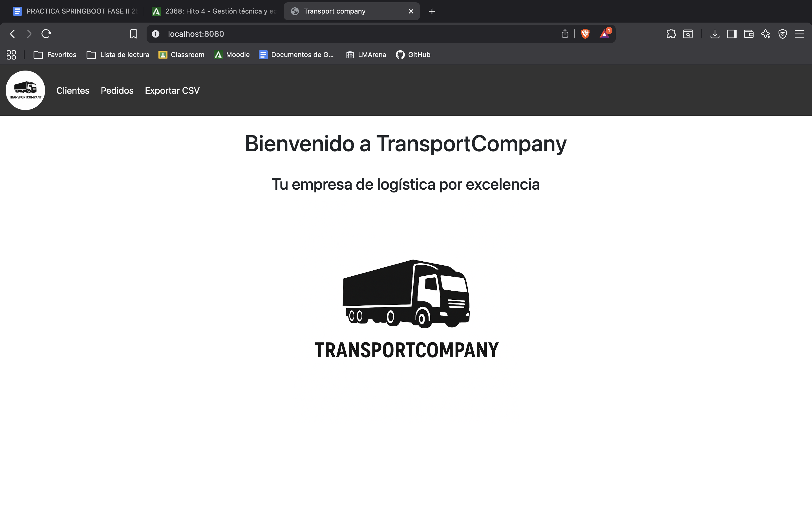
*Pantalla de inicio con acceso rápido a todos los módulos del sistema*

### 👥 Gestión de Clientes
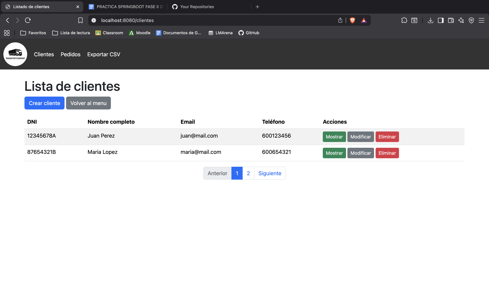
*Listado paginado de clientes con opciones de ver, editar y eliminar*

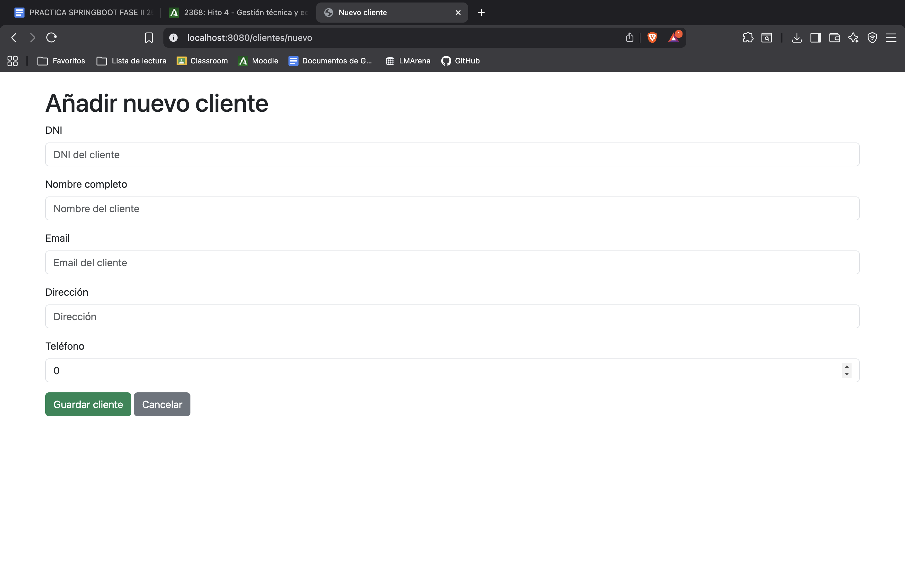
*Formulario para registrar un nuevo cliente en el sistema*

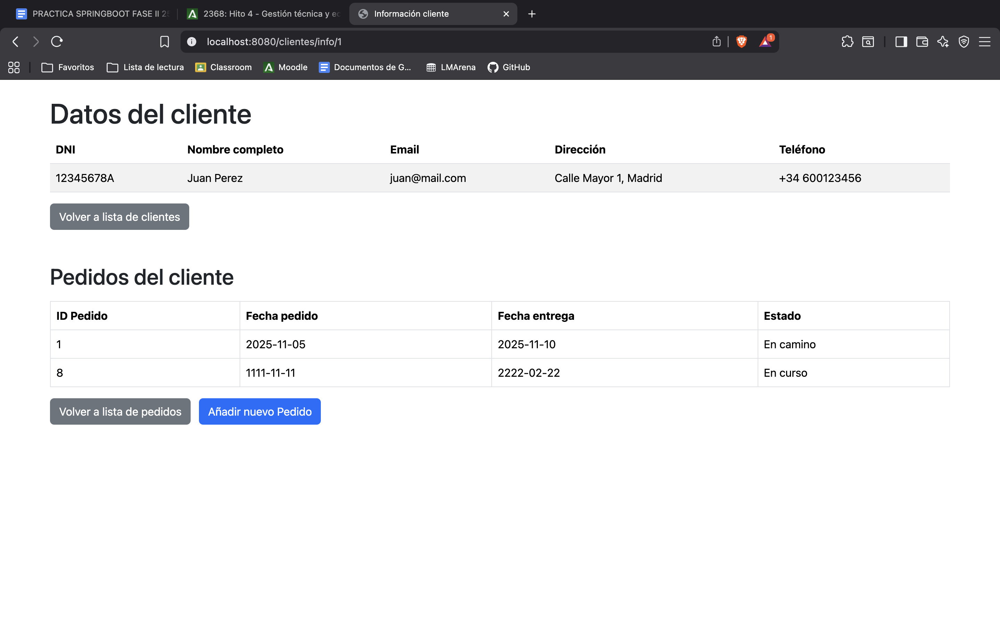
*Vista detallada del cliente con sus pedidos asociados*

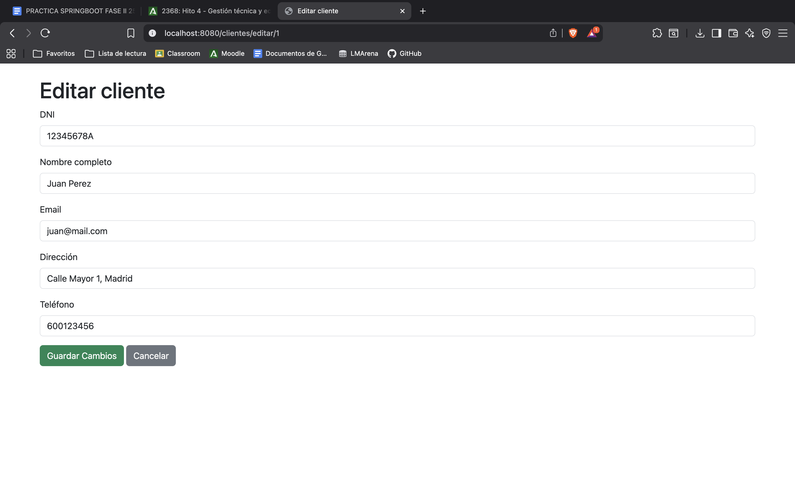

### 📦 Gestión de Pedidos

*Listado de pedidos con información de cliente, fechas y estado*

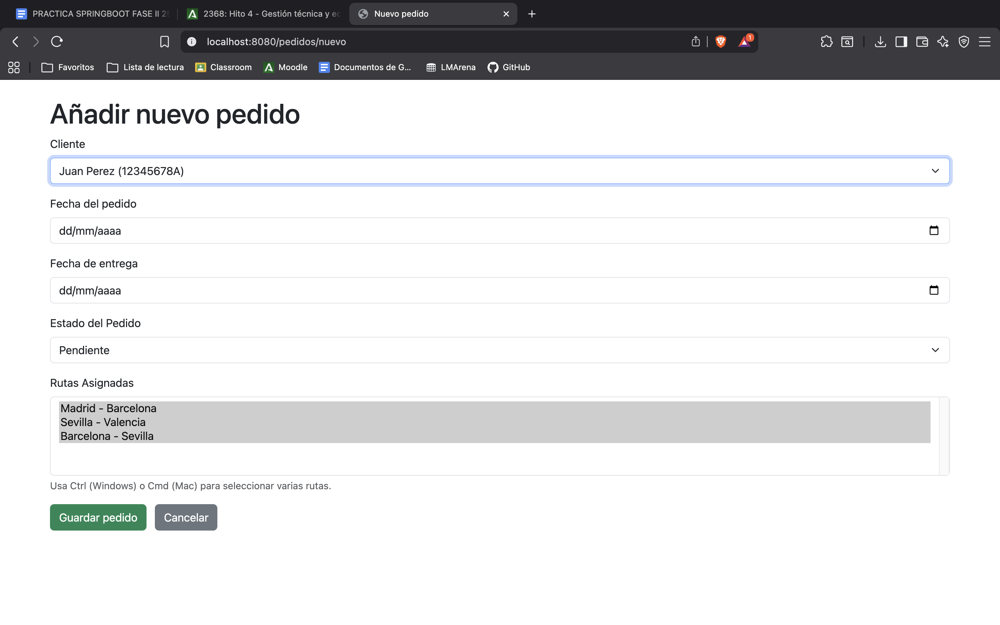
*Formulario de creación de pedido con selección de cliente y rutas*

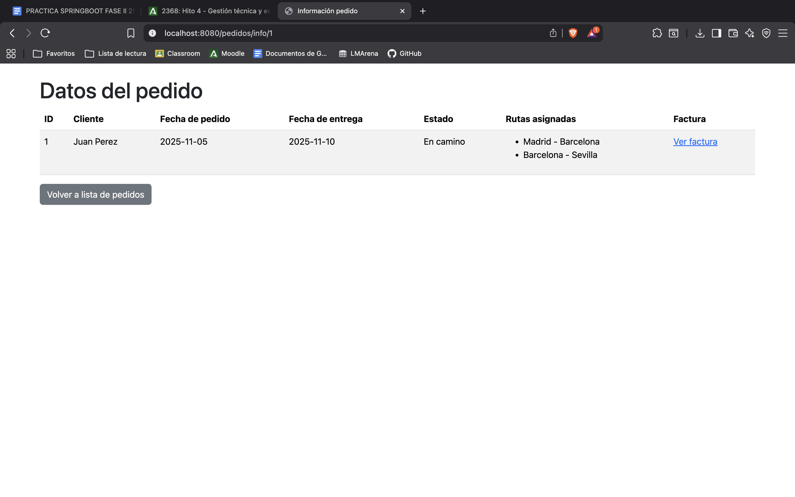

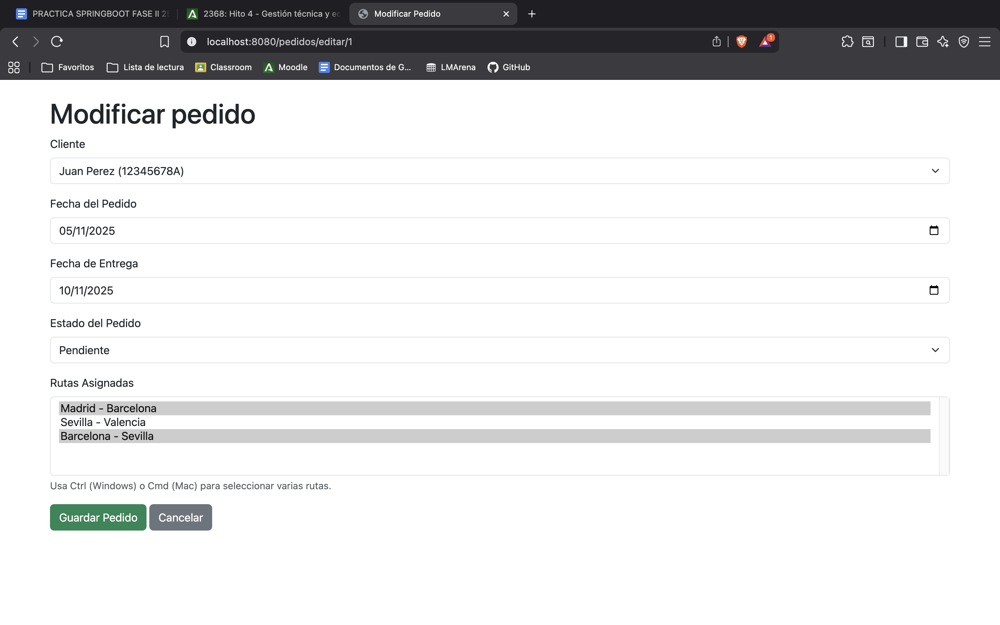


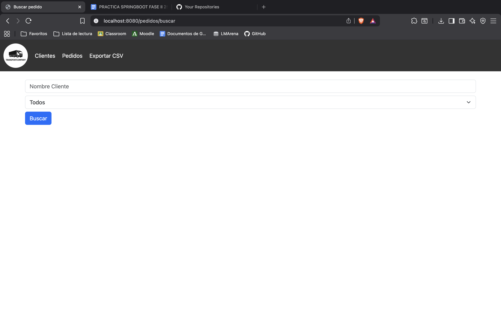
*Sistema de búsqueda avanzada por estado y cliente*

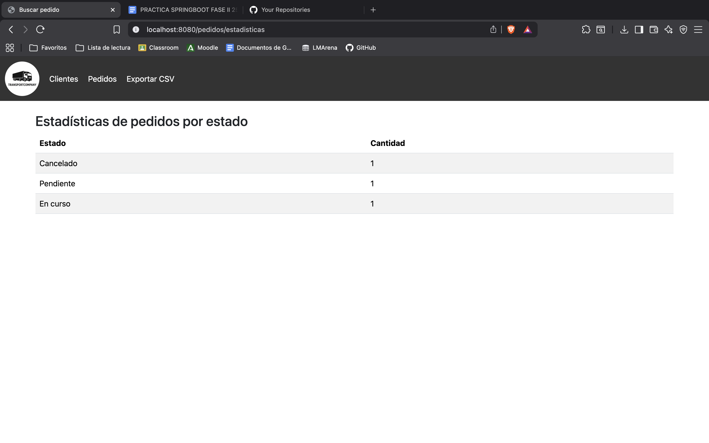
*Dashboard con estadísticas de pedidos por estado*

### 🧾 Facturas
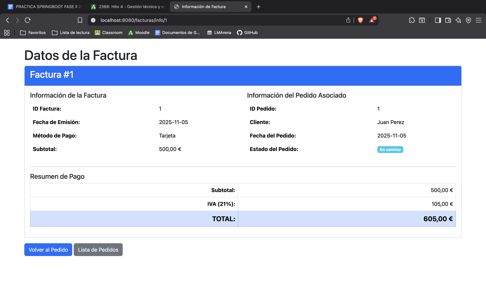
*Información completa de la factura generada automáticamente*

### 🗑️ Confirmación de Eliminación
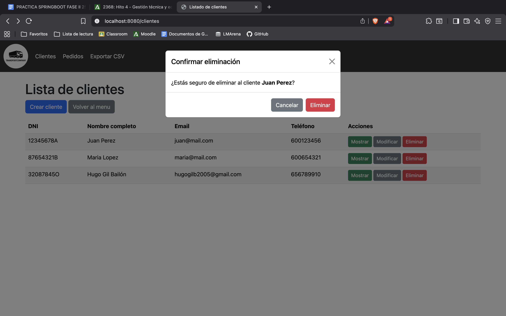
*Modal de Bootstrap para confirmar operaciones de eliminación*

### 📥 Exportación
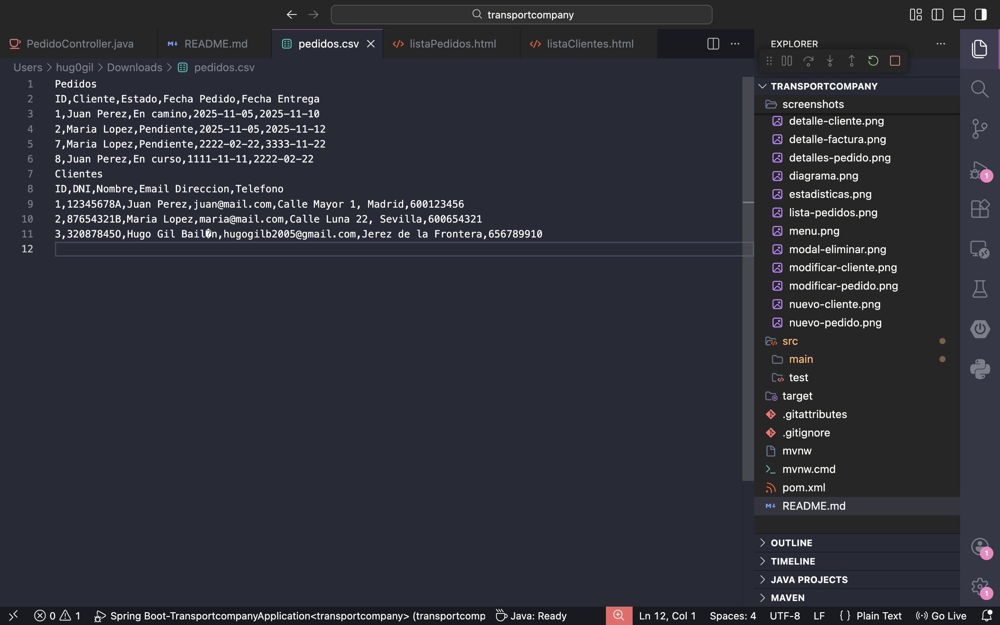
*Funcionalidad de exportación de datos en formato CSV*

## 🔌 Endpoints API

### Clientes
```
GET    /clientes                    # Listar todos (paginado)
GET    /clientes/nuevo              # Formulario crear
POST   /clientes/crear              # Guardar nuevo
GET    /clientes/editar/{id}        # Formulario editar
POST   /clientes/modificar          # Actualizar
GET    /clientes/info/{id}          # Ver detalles
GET    /clientes/eliminar/{id}      # Eliminar
```

### Pedidos
```
GET    /pedidos                     # Listar todos (paginado)
GET    /pedidos/nuevo               # Formulario crear
POST   /pedidos/crear               # Guardar nuevo
GET    /pedidos/editar/{id}         # Formulario editar
POST   /pedidos/modificar           # Actualizar
GET    /pedidos/info/{id}           # Ver detalles
GET    /pedidos/eliminar/{id}       # Eliminar
GET    /pedidos/buscar              # Formulario búsqueda
POST   /pedidos/buscar              # Ejecutar búsqueda
GET    /pedidos/estadisticas        # Ver estadísticas
```

### Facturas
```
GET    /facturas/info/{id}          # Ver detalles
```

### Utilidades
```
GET    /                            # Menú principal
GET    /exportar/csv                # Exportar datos a CSV
```

## 🔧 Configuración Avanzada

### Paginación
Configurable mediante parámetros de query:
```
/clientes?page=0&size=10
/pedidos?page=1&size=20
```

### Relaciones JPA

**Cliente → Pedido** (OneToMany con cascada)
```java
@OneToMany(mappedBy = "cliente", cascade = CascadeType.ALL)
private List<Pedido> pedidos;
```

**Pedido → Factura** (OneToOne con cascada y orphan removal)
```java
@OneToOne(mappedBy = "pedido", cascade = CascadeType.ALL, orphanRemoval = true)
private Factura factura;
```

**Pedido ↔ Ruta** (ManyToMany)
```java
@ManyToMany(cascade = {CascadeType.PERSIST, CascadeType.MERGE})
@JoinTable(name = "Pedido_has_Ruta", ...)
private List<Ruta> rutas;
```

## 📝 Logging

El sistema implementa logging completo con SLF4J:
- ✅ Creación de entidades
- ✏️ Modificación de entidades
- 🗑️ Eliminación de entidades
- ❌ Errores de operaciones

Ejemplo:
```java
logger.info("Cliente creado: {}", cliente);
logger.error("Error al eliminar pedido: {}", e.getMessage());
```